# BÁO CÁO KỸ THUẬT: HỆ THỐNG NỀN TẢNG THƯƠNG MẠI ĐIỆN TỬ ÁO DÀI
## Kiến trúc Microservices — 12 Dịch vụ Độc lập

**Ngày lập:** 07/05/2026  
**Phiên bản:** 1.0  
**Vai trò soạn thảo:** Software Architect & Bridge System Engineer (BSE)

---

# PHẦN 1: CƠ SỞ LÝ THUYẾT VỀ CÔNG NGHỆ SỬ DỤNG

## 1.1. Frontend Stack

### 1.1.1. React 19

React là thư viện JavaScript mã nguồn mở do Meta phát triển, chuyên xây dựng giao diện người dùng (User Interface — UI) theo mô hình **Component-Based Architecture**. Phiên bản React 19 mang đến các cải tiến quan trọng:

- **React Compiler**: Tự động tối ưu hóa re-render mà không cần `useMemo`/`useCallback` thủ công, giảm đáng kể boilerplate code.
- **Server Components**: Cho phép render component phía server, giảm JavaScript bundle gửi tới client.
- **Concurrent Rendering**: Cơ chế render không chặn (non-blocking) giúp UI luôn phản hồi mượt mà ngay cả khi xử lý tác vụ nặng.

**Vai trò trong hệ thống:** React 19 là nền tảng xây dựng **cả hai ứng dụng frontend** — Admin Dashboard (`Front-end/`, dùng Vite) và Client Storefront (`fe-client/`, dùng Next.js). Kiến trúc component-based cho phép tái sử dụng UI component giữa các module (Product Card, Order Table, v.v.).

### 1.1.2. Next.js 16

Next.js là React meta-framework do Vercel phát triển, cung cấp giải pháp **full-stack** cho ứng dụng web hiện đại. Trong hệ thống, Next.js 16 được sử dụng cho **Client Storefront** (`fe-client/`).

**Lý do lựa chọn:**
- **Server-Side Rendering (SSR)** và **Static Site Generation (SSG)**: Tối ưu SEO — yếu tố sống còn cho trang thương mại điện tử áo dài cần được index tốt bởi công cụ tìm kiếm.
- **App Router**: Hệ thống routing dựa trên cấu trúc thư mục `app/`, hỗ trợ layout lồng nhau (nested layouts), loading states, và error boundaries tự nhiên.
- **API Routes / Server Actions**: Cho phép proxy request tới backend microservices mà không expose trực tiếp internal API endpoints ra client, tăng cường bảo mật.
- **Image Optimization**: Tự động tối ưu ảnh sản phẩm áo dài (resize, format conversion sang WebP), cực kỳ quan trọng khi sản phẩm yêu cầu nhiều ảnh chất lượng cao tỉ lệ 3:4.

### 1.1.3. Vite 7

Vite là build tool thế hệ mới, sử dụng **ES Modules** native và **esbuild** để đạt tốc độ khởi động dev server gần như tức thời (< 300ms).

**Vai trò trong hệ thống:** Vite 7 được sử dụng làm bundler cho **Admin Dashboard** (`Front-end/`). Lý do chọn Vite thay vì Next.js cho admin:
- Admin dashboard là **Single Page Application (SPA)** thuần túy, không cần SSR/SSG vì không phục vụ SEO.
- **Hot Module Replacement (HMR)** cực nhanh, tăng năng suất phát triển.
- Bundle size nhỏ hơn so với Next.js khi không cần server-side features.

### 1.1.4. Zustand

Zustand là thư viện quản lý trạng thái (State Management) tối giản cho React, dựa trên mô hình **Flux đơn giản hóa** (simplified Flux pattern).

**Lý do lựa chọn thay vì Redux:**
- **API tối giản**: Không yêu cầu boilerplate (reducers, action creators, middleware) như Redux.
- **Bundle size nhỏ**: ~1KB gzipped, phù hợp với yêu cầu hiệu suất của e-commerce.
- **TypeScript-first**: Tích hợp tự nhiên với TypeScript, hỗ trợ type inference tốt.
- **Không cần Provider wrapper**: Giảm component tree nesting.

**Vai trò:** Quản lý global state cho Admin Dashboard — trạng thái authentication, cart state, filter/sort preferences, UI state (sidebar toggle, modal states).

### 1.1.5. Ant Design 6 (antd)

Ant Design là hệ thống thiết kế UI (Design System) cấp doanh nghiệp do Alibaba phát triển, cung cấp bộ component React phong phú, chuẩn hóa.

**Vai trò trong hệ thống:** Ant Design 6 là UI framework chính cho **Admin Dashboard**, cung cấp sẵn các component phức tạp:
- **Table** với pagination, sorting, filtering tích hợp — phục vụ danh sách sản phẩm, đơn hàng.
- **Form** với validation rules — phục vụ form tạo/sửa sản phẩm áo dài (nhiều trường, nhiều biến thể).
- **Charts** (`@ant-design/charts`) — phục vụ dashboard báo cáo doanh thu, thống kê.
- **Upload** component — phục vụ upload ảnh sản phẩm tỉ lệ 3:4.

### 1.1.6. TailwindCSS 4

TailwindCSS là framework CSS theo phương pháp **Utility-First**, cho phép styling trực tiếp trong markup bằng các class tiện ích được định nghĩa sẵn.

**Vai trò:** TailwindCSS 4 được sử dụng cho **Client Storefront** (`fe-client/`), kết hợp với Radix UI primitives (headless components) để xây dựng giao diện khách hàng tùy chỉnh cao, thẩm mỹ, phù hợp với thương hiệu áo dài.

---

## 1.2. Backend & System Stack

### 1.2.1. Node.js

Node.js là runtime environment cho JavaScript phía server, xây dựng trên **V8 Engine** của Google Chrome, hoạt động theo mô hình **Event-Driven, Non-Blocking I/O**.

**Lý do lựa chọn cho kiến trúc Microservices:**
- **Single-threaded Event Loop**: Phù hợp cho các service I/O-intensive (đọc/ghi database, gọi API bên ngoài), vốn chiếm đa số workload của e-commerce.
- **Lightweight**: Mỗi microservice Node.js tiêu thụ ít tài nguyên (RAM ~50-100MB), cho phép chạy đồng thời 12 service trên một máy chủ duy nhất.
- **JavaScript Ecosystem thống nhất**: Cùng ngôn ngữ giữa Frontend và Backend, giảm context-switching cho đội phát triển.
- **npm Ecosystem**: Hệ sinh thái package lớn nhất thế giới, hỗ trợ nhanh chóng tích hợp các thư viện cần thiết (Kafka client, Redis client, Mongoose ODM, v.v.).

### 1.2.2. TypeScript

TypeScript là superset của JavaScript, bổ sung **Static Type System** tại thời điểm biên dịch (compile-time).

**Vai trò trong hệ thống:**
- **Type Safety**: Giảm runtime errors, đặc biệt quan trọng trong hệ thống phân tán khi dữ liệu truyền giữa 12 services qua HTTP/Kafka.
- **Interface Contracts**: Định nghĩa rõ ràng cấu trúc dữ liệu (Product schema, Order schema) tại compile-time, đảm bảo tính nhất quán giữa các service.
- **Enhanced IDE Support**: IntelliSense, auto-completion, refactoring tools — tăng năng suất phát triển.
- **Documentation as Code**: Types tự thân là tài liệu kỹ thuật sống (living documentation).

### 1.2.3. Docker

Docker là nền tảng **containerization** cho phép đóng gói ứng dụng cùng toàn bộ dependencies vào các container cô lập, đảm bảo tính nhất quán giữa các môi trường (development, staging, production).

**Vai trò trong hệ thống:** Docker là **xương sống triển khai** (deployment backbone) của toàn bộ kiến trúc microservices, được orchestrate qua `docker-compose.yml`:
- **12 service containers** (auth:5000, share:5001, user:5002, products:5003, order:5004, cart:5005, payment:5006, contact:5010, news:5011, ai:5012, report:5014)
- **Infrastructure containers**: Redis (caching), Zookeeper + Kafka (message broker), Nginx (API Gateway)
- **Isolated Networking**: Tất cả container giao tiếp qua Docker bridge network (`admin-network`), cô lập hoàn toàn khỏi mạng host.
- **Health Checks**: Cơ chế kiểm tra sức khỏe tự động (ví dụ: User Service expose endpoint `/health`).

---

## 1.3. Architecture & Infrastructure Stack

### 1.3.1. Microservices Architecture

Kiến trúc Microservices phân tách hệ thống thành các **dịch vụ nhỏ, độc lập**, mỗi service đảm nhiệm một bounded context cụ thể và có database riêng (**Database-per-Service pattern**).

**12 Microservices trong hệ thống:**

| # | Service | Port | Database | Chức năng cốt lõi |
|---|---------|------|----------|-------------------|
| 1 | Auth Service | 5000 | MongoDB (Atlas) | Xác thực, JWT, đăng nhập/đăng ký |
| 2 | Share Service | 5001 | — | Upload ảnh (Cloudinary), gửi email (Kafka consumer) |
| 3 | User Service | 5002 | MongoDB (Atlas) | Quản lý thông tin người dùng, profile |
| 4 | Products Service | 5003 | MongoDB (Atlas) | Sản phẩm, danh mục, bộ sưu tập |
| 5 | Order Service | 5004 | MongoDB (Atlas) | Đơn hàng, trạng thái đơn hàng |
| 6 | Cart Service | 5005 | MongoDB (Atlas) | Giỏ hàng |
| 7 | Payment Service | 5006 | MongoDB (Atlas) | Thanh toán (MoMo integration) |
| 8 | Contact Service | 5010 | MongoDB (Atlas) | Liên hệ, phản hồi khách hàng |
| 9 | News Service | 5011 | MongoDB (Atlas) | Tin tức, bài viết, blog |
| 10 | AI Service | 5012 | MongoDB (Atlas) | Tư vấn AI (LangGraph + GPT) |
| 11 | Report Service | 5014 | — | Báo cáo, thống kê, analytics |
| 12 | API Gateway | 80 | — | Nginx reverse proxy, routing |

### 1.3.2. Nginx — Vai trò API Gateway

Nginx đóng vai trò **API Gateway** — điểm vào duy nhất (Single Entry Point) cho toàn bộ hệ thống, thực hiện các chức năng:

- **Reverse Proxy & Request Routing**: Phân phối request từ client tới đúng microservice dựa trên URL path pattern. Ví dụ: `/api/admin/products/*` → Products Service (port 5003), `/api/client/auth/*` → Auth Service (port 5000).
- **URL Rewriting**: Chuyển đổi public API path sang internal path. Ví dụ: `/api/admin/products/123` → `/api/v1/admin/product/123`.
- **CORS Handling**: Xử lý tập trung Cross-Origin Resource Sharing, bao gồm preflight OPTIONS requests, tránh mỗi service phải tự cấu hình CORS.
- **Load Balancing**: Hỗ trợ phân tải khi scale horizontally (hiện tại mỗi service 1 instance).
- **Client Max Body Size**: Cấu hình giới hạn upload file (50MB cho Share Service upload ảnh).

### 1.3.3. Redis — Caching Layer

Redis là in-memory data store, hoạt động như **caching layer** tập trung cho hệ thống.

**Vai trò trong hệ thống:**
- **Session/Token Caching**: Auth Service lưu trữ refresh tokens, blacklisted tokens trong Redis cho việc tra cứu O(1).
- **Product Data Caching**: Products Service cache kết quả truy vấn sản phẩm phổ biến, giảm tải MongoDB.
- **Rate Limiting Data**: Lưu trữ counter cho rate limiting API.
- **Deployment**: Chạy dưới dạng Docker container (`redis:7-alpine`) với persistent storage (AOF — Append Only File).

### 1.3.4. Apache Kafka — Message Broker

Apache Kafka là nền tảng **distributed event streaming**, đóng vai trò message broker cho giao tiếp bất đồng bộ (asynchronous communication) giữa các microservices.

**Vai trò trong hệ thống:**
- **Email Notification Pipeline**: Auth Service (producer) publish sự kiện `send-mail` khi user đăng ký/reset password → Share Service (consumer) nhận và gửi email qua SMTP.
- **Event-Driven Decoupling**: Tách rời (decouple) các nghiệp vụ không yêu cầu response tức thời, ví dụ: gửi email xác nhận đơn hàng không cần chặn luồng đặt hàng chính.
- **Deployment**: Kafka + Zookeeper chạy dưới dạng Docker containers. Topic `send-mail` được auto-create với 1 partition, 1 replica.

---

## 1.4. AI Stack

### 1.4.1. OpenAI GPT (gpt-4o-mini)

Hệ thống sử dụng model `gpt-4o-mini` thông qua **GitHub Models API** (`https://models.github.ai/inference`) làm LLM (Large Language Model) cốt lõi cho AI Service.

**Vai trò:** Xử lý ngôn ngữ tự nhiên (NLU) cho tất cả agents — hiểu intent khách hàng, sinh câu trả lời tư vấn, phân tích nội dung kiểm duyệt.

### 1.4.2. OpenAI Embeddings (text-embedding-3-large)

Model `text-embedding-3-large` được sử dụng để chuyển đổi văn bản mô tả sản phẩm thành **vector embeddings** đa chiều, phục vụ tìm kiếm ngữ nghĩa (semantic search).

**Vai trò:** Xây dựng **in-memory vector store** — khi AI Service khởi động, toàn bộ sản phẩm được embed và lưu trong bộ nhớ. Khi khách hàng hỏi "tìm áo dài lụa tơ tằm dưới 2 triệu", hệ thống tính **cosine similarity** giữa query embedding và product embeddings để trả về kết quả phù hợp nhất.

### 1.4.3. LangGraph — Supervisor Pattern

LangGraph là framework xây dựng **stateful, multi-agent** workflows dưới dạng đồ thị có hướng (directed graph). Hệ thống áp dụng **Supervisor Pattern** từ `@langchain/langgraph-supervisor`.

**Kiến trúc Multi-Agent trong hệ thống:**

| Agent | Vai trò | Tools |
|-------|---------|-------|
| **Supervisor** | Điều phối, phân tích intent, routing | — |
| **product_advisor** | Tư vấn sản phẩm áo dài | `search_products`, `get_product_detail`, `get_categories` |
| **content_moderator** | Kiểm duyệt nội dung bài viết | `moderate_content` |
| **utility_agent** | Truy vấn ngày/giờ, thời tiết | `get_current_date`, `get_weather` |
| **order_assistant** | Tra cứu đơn hàng khách hàng | `get_user_orders`, `get_order_detail` |

### 1.4.4. LangSmith — Observability & Tracing

LangSmith là nền tảng **observability** dành riêng cho ứng dụng LLM, cung cấp:
- **Distributed Tracing**: Theo dõi toàn bộ execution flow từ Supervisor → Agent → Tool → LLM call.
- **Prompt Debugging**: Xem chính xác prompt được gửi tới GPT và response nhận về.
- **Latency Analysis**: Phân tích thời gian xử lý từng bước trong pipeline.
- **Cost Monitoring**: Theo dõi token usage và chi phí API.

**Cấu hình:** `LANGSMITH_TRACING=true`, project name `DoAn`, endpoint `https://api.smith.langchain.com`.

---

# PHẦN 2: KIẾN TRÚC TỔNG THỂ & GIAO TIẾP HỆ THỐNG

## 2.1. Sơ đồ Kiến trúc Tổng thể

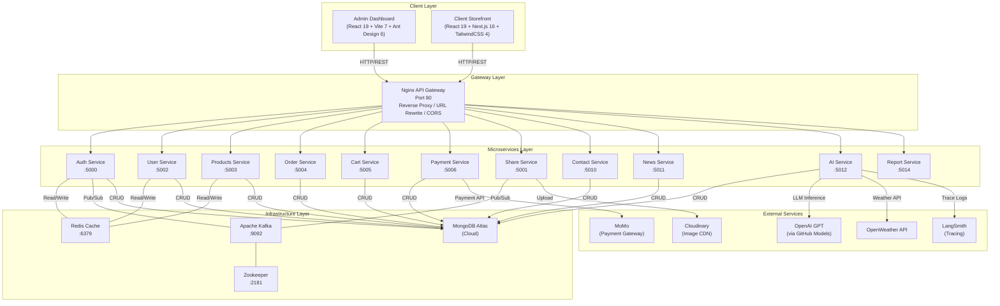

## 2.2. Luồng Request: Client → Nginx → Microservices

**Mô tả chi tiết luồng đi của một request:**

```mermaid
sequenceDiagram
    participant C as Client Browser
    participant NG as Nginx API Gateway :80
    participant AS as Auth Service :5000
    participant PS as Products Service :5003
    participant RD as Redis Cache
    participant DB as MongoDB Atlas

    Note over C,DB: Ví dụ: Client lấy danh sách sản phẩm (có xác thực)

    C->>NG: GET /api/client/products?page=1&limit=10
    Note right of NG: 1. CORS Check<br/>2. URL Rewrite:<br/>/api/client/products → /api/v1/client/product

    NG->>PS: GET /api/v1/client/product?page=1&limit=10
    Note right of PS: Proxy headers:<br/>X-Real-IP, X-Forwarded-For

    PS->>RD: GET cache:products:page1:limit10
    alt Cache HIT
        RD-->>PS: Cached product list
        PS-->>NG: 200 OK (from cache)
    else Cache MISS
        RD-->>PS: null
        PS->>DB: db.products.find({isDeleted: false}).skip(0).limit(10)
        DB-->>PS: Product documents
        PS->>RD: SET cache:products:page1:limit10 (TTL 5min)
        PS-->>NG: 200 OK (from DB)
    end

    NG-->>C: 200 OK + JSON Response
    Note right of NG: Add CORS headers:<br/>Access-Control-Allow-Origin
```

**Các bước chi tiết:**

1. **Client gửi request** tới Nginx API Gateway (port 80) — điểm vào duy nhất.
2. **Nginx xử lý CORS**: Với request OPTIONS (preflight), trả về 204 ngay lập tức kèm các CORS headers. Với request thực, thêm headers `Access-Control-Allow-Origin` và `Access-Control-Allow-Credentials`.
3. **URL Rewriting**: Nginx rewrite public path sang internal path (ví dụ: `/api/admin/products` → `/api/v1/admin/product`).
4. **Proxy Pass**: Forward request tới upstream service tương ứng, đính kèm proxy headers (`X-Real-IP`, `X-Forwarded-For`, `X-Forwarded-Proto`).
5. **Service xử lý**: Microservice nhận request, kiểm tra cache Redis, nếu miss thì truy vấn MongoDB, xử lý business logic, trả response.
6. **Response ngược lại**: Service → Nginx (thêm CORS headers) → Client.

## 2.3. Cơ chế Giao tiếp giữa các Services

### 2.3.1. Giao tiếp Đồng bộ (Synchronous — HTTP/REST)

Các service giao tiếp trực tiếp qua **internal HTTP calls** sử dụng Axios. Mỗi service được cấu hình URL của các service phụ thuộc qua environment variables.

**Bản đồ giao tiếp đồng bộ:**

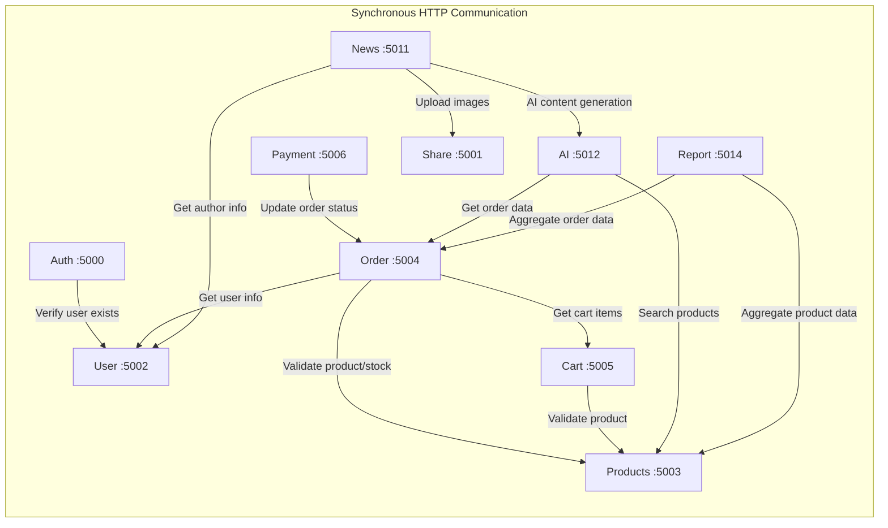

### 2.3.2. Giao tiếp Bất đồng bộ (Asynchronous — Apache Kafka)

Kafka được sử dụng cho các tác vụ **fire-and-forget** — nơi producer không cần chờ consumer xử lý xong.

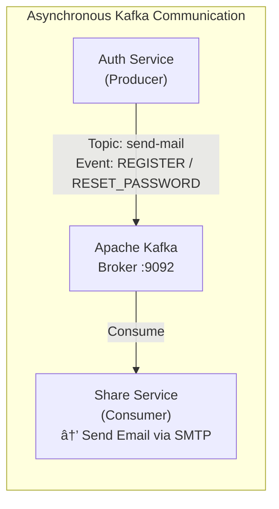

**Luồng chi tiết:**

1. **Auth Service** (producer) publish message vào Kafka topic `send-mail` khi xảy ra sự kiện đăng ký tài khoản, kích hoạt tài khoản, hoặc yêu cầu đặt lại mật khẩu.
2. **Kafka broker** lưu message vào partition, đảm bảo durability.
3. **Share Service** (consumer) subscribe topic `send-mail`, nhận message và gửi email qua SMTP sử dụng credentials `EMAIL_USER`/`EMAIL_PASS`.

**Ưu điểm của Kafka trong luồng này:**
- **Decoupling**: Auth Service không phụ thuộc vào Share Service — nếu email server down, message vẫn được lưu trong Kafka và sẽ được xử lý khi Share Service recover.
- **Guaranteed Delivery**: Kafka đảm bảo message không bị mất nhờ persistent storage.
- **Backpressure Handling**: Nếu có spike đăng ký hàng loạt, Kafka buffer messages, Share Service xử lý theo tốc độ riêng.

---

# PHẦN 3: ĐẶC TẢ USECASE CHO TOÀN BỘ SERVICES

## 3.1. Tổng quan Usecase theo Service

### 3.1.1. Auth Service — Xác thực & Phân quyền

| ID | Usecase | Actor | Mô tả |
|----|---------|-------|-------|
| UC-AUTH-01 | Đăng ký tài khoản | Guest | Đăng ký bằng email/password, gửi email kích hoạt qua Kafka |
| UC-AUTH-02 | Kích hoạt tài khoản | Guest | Xác thực token kích hoạt từ email |
| UC-AUTH-03 | Đăng nhập | Guest | Xác thực credentials, phát hành Access Token (JWT) + Refresh Token (HTTP-only cookie) |
| UC-AUTH-04 | Đăng xuất | Member/Admin | Thu hồi token, thêm vào Redis blacklist |
| UC-AUTH-05 | Làm mới token | Member/Admin | Sử dụng Refresh Token để phát hành Access Token mới |
| UC-AUTH-06 | Quên mật khẩu | Guest | Gửi email chứa link reset password (token có TTL 15 phút) |
| UC-AUTH-07 | Đặt lại mật khẩu | Guest | Xác thực reset token, cập nhật password mới (bcrypt hash) |
| UC-AUTH-08 | Đăng nhập Admin | Staff/Admin | Xác thực với role-based access control (RBAC) cho admin dashboard |

### 3.1.2. User Service — Quản lý Người dùng

| ID | Usecase | Actor | Mô tả |
|----|---------|-------|-------|
| UC-USER-01 | Xem thông tin cá nhân | Member | Lấy profile: name, email, phone, avatar, địa chỉ |
| UC-USER-02 | Cập nhật thông tin cá nhân | Member | Sửa profile, upload avatar qua Share Service |
| UC-USER-03 | Quản lý địa chỉ giao hàng | Member | CRUD địa chỉ (fullName, phone, street, ward, city) |
| UC-USER-04 | Đổi mật khẩu | Member | Xác thực mật khẩu cũ, hash mật khẩu mới |
| UC-USER-05 | Xem danh sách người dùng | Admin | Pagination, search, filter theo role/status |
| UC-USER-06 | Cập nhật role người dùng | Admin | Gán/thu hồi role (member, staff, admin) |
| UC-USER-07 | Vô hiệu hóa tài khoản | Admin | Soft disable tài khoản vi phạm |
| UC-USER-08 | Xem lịch sử đơn hàng | Member | Gọi internal API tới Order Service |

### 3.1.3. Products Service — Quản lý Sản phẩm, Danh mục, Bộ sưu tập

| ID | Usecase | Actor | Mô tả |
|----|---------|-------|-------|
| UC-PROD-01 | Thêm mới sản phẩm áo dài | Admin | Nhập thông tin, ảnh (tỉ lệ 3:4), biến thể size, specs chất liệu, auto-generate SEO |
| UC-PROD-02 | Cập nhật sản phẩm | Admin | Sửa thông tin, auto-regenerate SEO khi thay đổi trường quan trọng |
| UC-PROD-03 | Xóa sản phẩm (Soft Delete) | Admin | Set `isDeleted=true`, kiểm tra đơn hàng pending trước khi xóa |
| UC-PROD-04 | Xem chi tiết sản phẩm | Admin/Member | Populate category, collection, hiển thị đầy đủ specs |
| UC-PROD-05 | Danh sách sản phẩm | Admin/Guest | Pagination, search tiếng Việt, filter (category, gender, status, productType) |
| UC-PROD-06 | Thay đổi trạng thái sản phẩm | Admin | Toggle: active / inactive / draft |
| UC-PROD-07 | Bulk Actions | Admin | Thay đổi trạng thái / xóa hàng loạt |
| UC-PROD-08 | Quản lý biến thể size | Admin | CRUD size, auto-recalculate totalStock |
| UC-PROD-09 | Upload ảnh sản phẩm | Admin | Validate format/size, auto-resize 3:4, upload Cloudinary |
| UC-CAT-01 | Quản lý danh mục | Admin | CRUD danh mục, auto-generate slug, update productCount |
| UC-COLL-01 | Quản lý bộ sưu tập | Admin | CRUD bộ sưu tập (Tết, Cưới hỏi, Kỷ yếu), gán sản phẩm |

### 3.1.4. Order Service — Quản lý Đơn hàng

| ID | Usecase | Actor | Mô tả |
|----|---------|-------|-------|
| UC-ORD-01 | Tạo đơn hàng | Member | Lấy giỏ hàng từ Cart Service, validate stock từ Products Service, tạo orderNumber |
| UC-ORD-02 | Xem danh sách đơn hàng | Admin | Pagination, filter theo status/paymentStatus/dateRange |
| UC-ORD-03 | Xem chi tiết đơn hàng | Admin/Member | Hiển thị items, shippingAddress, payment info, timeline |
| UC-ORD-04 | Cập nhật trạng thái đơn | Admin | Chuyển trạng thái: pending → confirmed → shipped → delivered |
| UC-ORD-05 | Hủy đơn hàng | Member/Admin | Chỉ cho phép khi status = pending, hoàn trả stock |
| UC-ORD-06 | Tra cứu đơn theo mã | Member | Tìm đơn bằng orderNumber (VD: ORD-1234567890-ABCDE) |
| UC-ORD-07 | Xem sao kê đơn hàng | Member | Internal API cho AI Service tra cứu đơn hàng |

### 3.1.5. Cart Service — Giỏ hàng

| ID | Usecase | Actor | Mô tả |
|----|---------|-------|-------|
| UC-CART-01 | Thêm sản phẩm vào giỏ | Member | Validate product + size + stock từ Products Service |
| UC-CART-02 | Cập nhật số lượng | Member | Validate stock availability, recalculate subtotal |
| UC-CART-03 | Xóa sản phẩm khỏi giỏ | Member | Remove item, recalculate cart total |
| UC-CART-04 | Xem giỏ hàng | Member | Populate product details (name, price, thumbnail) |
| UC-CART-05 | Xóa toàn bộ giỏ hàng | Member | Clear all items (thường sau khi đặt hàng thành công) |

### 3.1.6. Payment Service — Thanh toán

| ID | Usecase | Actor | Mô tả |
|----|---------|-------|-------|
| UC-PAY-01 | Thanh toán COD | Member | Đặt hàng với phương thức thanh toán khi nhận hàng |
| UC-PAY-02 | Thanh toán MoMo | Member | Tạo payment request tới MoMo API, redirect user |
| UC-PAY-03 | Xử lý callback MoMo | System | Nhận IPN callback từ MoMo, verify signature, cập nhật paymentStatus |
| UC-PAY-04 | Xem lịch sử thanh toán | Admin | Danh sách transactions, filter theo method/status |

### 3.1.7. Share Service — Dịch vụ Dùng chung

| ID | Usecase | Actor | Mô tả |
|----|---------|-------|-------|
| UC-SHARE-01 | Upload ảnh đơn/nhiều | Admin | Upload tới Cloudinary, trả về URL + public_id |
| UC-SHARE-02 | Xóa ảnh | Admin | Xóa ảnh từ Cloudinary bằng public_id |
| UC-SHARE-03 | Gá»­i email (Kafka Consumer) | System | Consume topic `send-mail`, gá»­i email qua SMTP |

### 3.1.8. Contact Service — Liên hệ

| ID | Usecase | Actor | Mô tả |
|----|---------|-------|-------|
| UC-CONTACT-01 | Gửi form liên hệ | Guest/Member | Submit câu hỏi/phản hồi |
| UC-CONTACT-02 | Xem danh sách liên hệ | Admin | Pagination, filter theo trạng thái (mới/đã đọc/đã phản hồi) |
| UC-CONTACT-03 | Phản hồi liên hệ | Admin | Reply trực tiếp, cập nhật trạng thái |

### 3.1.9. News Service — Tin tức & Blog

| ID | Usecase | Actor | Mô tả |
|----|---------|-------|-------|
| UC-NEWS-01 | Tạo bài viết | Admin | Soạn thảo (TinyMCE), upload ảnh, AI hỗ trợ content generation |
| UC-NEWS-02 | Cập nhật bài viết | Admin | Sửa nội dung, trạng thái (draft/published) |
| UC-NEWS-03 | Xóa bài viết | Admin | Soft delete |
| UC-NEWS-04 | Xem danh sách bài viết | Guest/Member | Pagination, filter theo category, SEO-friendly URLs |
| UC-NEWS-05 | Kiểm duyệt nội dung | Admin | Gọi AI Service để moderate content trước khi publish |

### 3.1.10. AI Service — Tư vấn Thông minh

| ID | Usecase | Actor | Mô tả |
|----|---------|-------|-------|
| UC-AI-01 | Tư vấn sản phẩm áo dài | Member | Chat với AI, nhận gợi ý sản phẩm phù hợp (semantic search) |
| UC-AI-02 | Tra cứu đơn hàng qua AI | Member | Hỏi AI về trạng thái đơn hàng, lịch sử mua |
| UC-AI-03 | Kiểm duyệt nội dung bài viết | Admin | AI phân tích văn bản, đánh giá mức độ an toàn |
| UC-AI-04 | Truy vấn tiện ích | Member | Hỏi ngày/giờ, thời tiết (tích hợp OpenWeather) |
| UC-AI-05 | Lưu lịch sử hội thoại | Member | Persist conversation history vào MongoDB |

### 3.1.11. Report Service — Báo cáo & Thống kê

| ID | Usecase | Actor | Mô tả |
|----|---------|-------|-------|
| UC-RPT-01 | Dashboard tổng quan | Admin | Tổng doanh thu, đơn hàng, sản phẩm bán chạy |
| UC-RPT-02 | Báo cáo doanh thu theo kỳ | Admin | Aggregate order data theo ngày/tuần/tháng |
| UC-RPT-03 | Thống kê sản phẩm | Admin | Top selling, low stock alerts, category performance |
| UC-RPT-04 | Export báo cáo | Admin | Xuất Excel/PDF |

## 3.2. Sơ đồ Usecase Tổng quát

```mermaid
graph TB
    subgraph Actors
        Guest["🧑 Guest<br/>(Khách vãng lai)"]
        Member["👤 Member<br/>(Thành viên)"]
        Admin["👨‍💼 Admin<br/>(Quản trị viên)"]
    end

    subgraph "Auth Service"
        A1["Đăng ký tài khoản"]
        A2["Đăng nhập"]
        A3["Quên / Đặt lại mật khẩu"]
        A4["Đăng xuất / Làm mới token"]
    end

    subgraph "Products Service"
        P1["Xem danh sách sản phẩm"]
        P2["Xem chi tiết sản phẩm"]
        P3["Tìm kiếm sản phẩm"]
        P4["CRUD Sản phẩm"]
        P5["Quản lý Danh mục"]
        P6["Quản lý Bộ sưu tập"]
    end

    subgraph "Order Service"
        O1["Tạo đơn hàng"]
        O2["Xem đơn hàng của tôi"]
        O3["Hủy đơn hàng"]
        O4["Quản lý đơn hàng"]
        O5["Cập nhật trạng thái đơn"]
    end

    subgraph "Cart Service"
        C1["Quản lý giỏ hàng"]
    end

    subgraph "Payment Service"
        PM1["Thanh toán COD"]
        PM2["Thanh toán MoMo"]
    end

    subgraph "AI Consultation Service"
        AI1["Tư vấn sản phẩm AI"]
        AI2["Tra cứu đơn hàng AI"]
        AI3["Kiểm duyệt nội dung"]
    end

    subgraph "Other Services"
        N1["Xem tin tức / blog"]
        N2["Quản lý tin tức"]
        CT1["Gửi form liên hệ"]
        CT2["Quản lý liên hệ"]
        R1["Xem báo cáo thống kê"]
        U1["Quản lý profile"]
        U2["Quản lý người dùng"]
    end

    Guest --> A1 & A2 & A3
    Guest --> P1 & P2 & P3
    Guest --> N1 & CT1

    Member --> A4
    Member --> P1 & P2 & P3
    Member --> C1 --> O1
    O1 --> PM1 & PM2
    Member --> O2 & O3
    Member --> AI1 & AI2
    Member --> U1 & N1

    Admin --> A4
    Admin --> P4 & P5 & P6
    Admin --> O4 & O5
    Admin --> AI3
    Admin --> N2 & CT2 & R1 & U2
```

---

# PHẦN 4: SƠ ĐỒ LUỒNG HOẠT ĐỘNG (ACTIVITY FLOW)

## 4.1. Luồng Đăng nhập & Xác thực (Authentication Flow)

```mermaid
flowchart TD
    Start(["🟢 Bắt đầu"]) --> InputCredentials["User nhập Email + Password"]
    InputCredentials --> SendRequest["Client gá»­i POST /api/client/auth/login"]
    SendRequest --> NginxRoute["Nginx rewrite → /api/v1/client/auth/login<br/>Proxy Pass → Auth Service :5000"]
    NginxRoute --> ValidateInput{"Validate input<br/>(email format, password min length)"}

    ValidateInput -->|"❌ Invalid"| ReturnError400["Return 400: Validation Error"]
    ReturnError400 --> End1(["🔴 Kết thúc"])

    ValidateInput -->|"✅ Valid"| FindUser["Query MongoDB: findOne({email})"]
    FindUser --> UserExists{"User tồn tại?"}
    UserExists -->|"❌ Không"| Return401["Return 401: Email không tồn tại"]
    Return401 --> End2(["🔴 Kết thúc"])

    UserExists -->|"✅ Có"| CheckActivated{"Tài khoản<br/>đã kích hoạt?"}
    CheckActivated -->|"❌ Chưa"| Return403["Return 403: Chưa kích hoạt"]
    Return403 --> End3(["🔴 Kết thúc"])

    CheckActivated -->|"✅ Rồi"| ComparePassword["bcrypt.compare(inputPassword, hashedPassword)"]
    ComparePassword --> PasswordMatch{"Mật khẩu<br/>khớp?"}
    PasswordMatch -->|"❌ Sai"| Return401b["Return 401: Sai mật khẩu"]
    Return401b --> End4(["🔴 Kết thúc"])

    PasswordMatch -->|"✅ Đúng"| GenerateTokens["Phát hành JWT Tokens:<br/>• Access Token (1h TTL)<br/>• Refresh Token (30d TTL)"]
    GenerateTokens --> StoreRefresh["Lưu Refresh Token vào Redis<br/>Key: refresh:{userId}, TTL: 30 days"]
    StoreRefresh --> SetCookie["Set HTTP-Only Cookie:<br/>refreshToken, maxAge=30d, sameSite=lax"]
    SetCookie --> ReturnSuccess["Return 200:<br/>{accessToken, user: {id, name, email, role}}"]
    ReturnSuccess --> ClientStore["Client lưu accessToken<br/>vào Zustand store"]
    ClientStore --> End5(["🟢 Kết thúc"])
```

## 4.2. Luồng Đặt hàng & Thanh toán (Order + Payment Flow)

```mermaid
flowchart TD
    Start(["🟢 Member click Đặt hàng"]) --> SendOrder["POST /api/client/order<br/>{shippingAddress, paymentMethod, customerNote}"]
    SendOrder --> NginxProxy["Nginx → Order Service :5004"]
    NginxProxy --> AuthMiddleware{"JWT Middleware<br/>Verify Access Token"}
    AuthMiddleware -->|"❌ Invalid/Expired"| Return401["Return 401: Unauthorized"]
    Return401 --> End1(["🔴 Kết thúc"])

    AuthMiddleware -->|"✅ Valid"| FetchCart["Gọi Cart Service :5005<br/>GET /api/v1/client/cart/{userId}"]
    FetchCart --> CartEmpty{"Giỏ hàng<br/>trống?"}
    CartEmpty -->|"✅ Trống"| Return400["Return 400: Giỏ hàng trống"]
    Return400 --> End2(["🔴 Kết thúc"])

    CartEmpty -->|"❌ Có items"| ValidateStock["Gọi Products Service :5003<br/>Validate từng item: stock ≥ quantity"]
    ValidateStock --> StockOK{"Tất cả<br/>còn đủ hàng?"}
    StockOK -->|"❌ Hết hàng"| Return409["Return 409: Sản phẩm XYZ hết size M"]
    Return409 --> End3(["🔴 Kết thúc"])

    StockOK -->|"✅ Đủ"| CalcTotal["Tính toán:<br/>subtotal = Σ(price × quantity)<br/>shippingFee = calculateShipping()<br/>totalAmount = subtotal + shippingFee"]
    CalcTotal --> GenOrderNumber["Sinh mã đơn:<br/>ORD-{timestamp}-{random5chars}"]
    GenOrderNumber --> CreateOrder["Lưu Order vào MongoDB:<br/>status=pending, paymentStatus=unpaid"]
    CreateOrder --> DeductStock["Gọi Products Service<br/>Trừ stock cho từng sản phẩm"]
    DeductStock --> ClearCart["Gọi Cart Service<br/>Xóa giỏ hàng"]

    ClearCart --> CheckPayment{"Phương thức<br/>thanh toán?"}

    CheckPayment -->|"COD"| ReturnOrderCOD["Return 201:<br/>{order, message: Đặt hàng thành công}"]
    ReturnOrderCOD --> End4(["🟢 Kết thúc"])

    CheckPayment -->|"MoMo"| CreateMoMo["Gọi Payment Service :5006<br/>POST /api/v1/client/payment/momo"]
    CreateMoMo --> MoMoRequest["Payment Service tạo request tới MoMo API:<br/>• partnerCode, accessKey<br/>• amount, orderId<br/>• redirectUrl, ipnUrl<br/>• HMAC-SHA256 signature"]
    MoMoRequest --> MoMoResponse["MoMo trả về payUrl"]
    MoMoResponse --> RedirectUser["Redirect User → MoMo Payment Page"]
    RedirectUser --> UserPay["User xác nhận thanh toán trên MoMo"]
    UserPay --> MoMoCallback["MoMo gọi IPN Callback<br/>POST /api/client/payment/momo/callback"]
    MoMoCallback --> VerifySignature{"Verify HMAC<br/>Signature"}
    VerifySignature -->|"❌ Invalid"| LogFraud["Log: Possible fraud attempt"]
    LogFraud --> End5(["🔴 Kết thúc"])

    VerifySignature -->|"✅ Valid"| CheckResult{"resultCode == 0?"}
    CheckResult -->|"✅ Success"| UpdatePaid["Cập nhật Order:<br/>paymentStatus = paid"]
    UpdatePaid --> End6(["🟢 Kết thúc"])
    CheckResult -->|"❌ Failed"| UpdateFailed["Cập nhật Order:<br/>paymentStatus = failed"]
    UpdateFailed --> End7(["🔴 Kết thúc"])
```

## 4.3. Luồng Đồng bộ Dữ liệu bằng Kafka (Email Notification Flow)

```mermaid
flowchart TD
    Start(["🟢 Sự kiện kích hoạt"]) --> TriggerEvent{"Loại sự kiện?"}

    TriggerEvent -->|"Đăng ký mới"| Register["Auth Service: User đăng ký<br/>→ Tạo activation token (1h TTL)"]
    TriggerEvent -->|"Quên mật khẩu"| ForgotPW["Auth Service: User yêu cầu reset<br/>→ Tạo reset token (15min TTL)"]
    TriggerEvent -->|"Đơn hàng mới"| NewOrder["Order Service: Đơn hàng tạo thành công"]

    Register & ForgotPW & NewOrder --> ProduceMsg["Kafka Producer (Auth/Order Service):<br/>kafka.producer.send({<br/>  topic: 'send-mail',<br/>  messages: [{<br/>    value: JSON.stringify({<br/>      type: 'REGISTER' | 'RESET_PW' | 'ORDER_CONFIRM',<br/>      to: user.email,<br/>      data: {name, token/orderNumber}<br/>    })<br/>  }]<br/>})"]

    ProduceMsg --> KafkaBroker["Apache Kafka Broker :9092<br/>Topic: send-mail<br/>Partition: 0, Offset: N"]

    KafkaBroker --> ConsumeMsg["Kafka Consumer (Share Service :5001):<br/>kafka.consumer.subscribe({topic: 'send-mail'})<br/>kafka.consumer.run({eachMessage})"]

    ConsumeMsg --> ParseMsg["Parse message:<br/>const {type, to, data} = JSON.parse(value)"]

    ParseMsg --> BuildEmail{"Loại email?"}
    BuildEmail -->|"REGISTER"| EmailActivate["Tạo email kích hoạt:<br/>Subject: Kích hoạt tài khoản<br/>Body: Link /activate?token=xxx"]
    BuildEmail -->|"RESET_PW"| EmailReset["Tạo email reset password:<br/>Subject: Đặt lại mật khẩu<br/>Body: Link /reset-password?token=xxx"]
    BuildEmail -->|"ORDER_CONFIRM"| EmailOrder["Tạo email xác nhận đơn:<br/>Subject: Đơn hàng ORD-xxx<br/>Body: Chi tiết đơn hàng"]

    EmailActivate & EmailReset & EmailOrder --> SendSMTP["Gá»­i email qua SMTP:<br/>nodemailer.sendMail({<br/>  from: EMAIL_USER,<br/>  to: recipient,<br/>  subject, html<br/>})"]

    SendSMTP --> Result{"Gửi thành công?"}
    Result -->|"✅"| LogSuccess["Log: Email sent successfully"]
    Result -->|"❌"| RetryOrDLQ["Retry hoặc chuyển vào<br/>Dead Letter Queue (DLQ)"]

    LogSuccess & RetryOrDLQ --> End(["🔴 Kết thúc"])
```

---

# PHẦN 5: THIẾT KẾ CHUYÊN SÂU AI SERVICE (AI CONSULTATION SERVICE)

## 5.1. Tổng quan Chức năng

AI Service (`AI_services/`, port 5012) là dịch vụ trí tuệ nhân tạo cốt lõi của hệ thống, đóng vai trò **trợ lý ảo thông minh** (Virtual Shopping Assistant) cho khách hàng và **công cụ kiểm duyệt nội dung** cho quản trị viên. Service được xây dựng trên nền tảng **LangGraph Multi-Agent** với **Supervisor Pattern**.

### 5.1.1. Chức năng chính

| Chức năng | Mô tả | Agent xử lý |
|-----------|-------|-------------|
| **Tư vấn sản phẩm áo dài** | Hiểu ngôn ngữ tự nhiên của khách, tìm kiếm sản phẩm phù hợp bằng semantic search (vector embeddings), trả lời với format đẹp mắt | `product_advisor` |
| **Tra cứu đơn hàng** | Khách hỏi trạng thái đơn hàng bằng ngôn ngữ tự nhiên, AI tra cứu và trình bày kết quả dễ hiểu | `order_assistant` |
| **Kiểm duyệt nội dung** | Phân tích văn bản bài viết/tin tức, đánh giá mức độ an toàn (bạo lực, spam, nội dung nhạy cảm) | `content_moderator` |
| **Truy vấn tiện ích** | Cung cấp thông tin ngày/giờ thực, thời tiết hiện tại (tích hợp OpenWeather API) | `utility_agent` |
| **Quản lý hội thoại** | Điều hướng ngữ cảnh, xử lý câu hỏi ngoài phạm vi, duy trì tông giọng thân thiện, chuyên nghiệp | `supervisor` |

### 5.1.2. Kiến trúc kỹ thuật

**In-Memory Vector Store:**
- Khi service khởi động, gọi Products Service API lấy toàn bộ sản phẩm active.
- Mỗi sản phẩm được chuyển thành text mô tả (tên, chất liệu, phong cách, giá, danh mục, tags...).
- Text được embed thành vector bằng `text-embedding-3-large` (batch size = 20, delay 1s giữa các batch).
- Vectors lưu trong RAM (array `productDocs[]`), tìm kiếm bằng **cosine similarity**.

**LangGraph Supervisor Architecture:**
- **Supervisor Node**: Nhận message từ user, phân tích intent, routing tới agent phù hợp.
- **Agent Nodes**: Mỗi agent là một `ReactAgent` với tools chuyên biệt, prompt riêng.
- **Tool Nodes**: Các function thực thi nghiệp vụ cụ thể (gọi API, tính toán, v.v.).
- **State Management**: LangGraph quản lý conversation state (message history) dưới dạng graph state.

### 5.1.3. Bảo mật & Ràng buộc

- **User Context Injection**: Khi bắt đầu hội thoại, hệ thống inject `[HỆ THỐNG] userId: xxx` vào message đầu tiên. Order Assistant chỉ truy vấn đơn hàng của đúng userId này, ngăn chặn truy cập trái phép.
- **No Hallucination Policy**: Product Advisor **bắt buộc** gọi tool `search_products` trước khi tư vấn, tuyệt đối không tự bịa sản phẩm.
- **Scope Guard**: Câu hỏi ngoài phạm vi (ăn uống, tâm sự) được Supervisor xử lý trực tiếp với câu trả lời ngắn gọn, sau đó khéo léo điều hướng về sản phẩm áo dài.

## 5.2. Sơ đồ Activity Diagram — AI Service

```mermaid
flowchart TD
    Start(["🟢 User gửi message"]) --> API["POST /api/ai/chat<br/>{message, conversationId, userId}"]
    API --> NginxRewrite["Nginx: /api/ai/* → /ai/*<br/>Proxy → AI Service :5012"]
    NginxRewrite --> Controller["AI Controller nhận request"]
    Controller --> InjectCtx["Inject System Context:<br/>Prepend '[HỆ THỐNG] userId: {userId}'<br/>vào message đầu tiên nếu chưa có"]

    InjectCtx --> SupervisorNode["🧠 SUPERVISOR NODE<br/>(LangGraph Supervisor)<br/>Model: gpt-4o-mini"]

    SupervisorNode --> AnalyzeIntent["Phân tích Intent của User<br/>Dựa trên prompt routing rules"]

    AnalyzeIntent --> RouteDecision{"Routing<br/>Decision?"}

    %% Product Advisor Path
    RouteDecision -->|"Hỏi mua/tư vấn<br/>sản phẩm"| PA["🛍️ PRODUCT ADVISOR AGENT"]
    PA --> PA_Extract["Bước 1: Bóc tách thông tin<br/>• Loại: áo dài, váy, quần...<br/>• Chất liệu: lụa, gấm, voan...<br/>• Ngân sách: 500k → 500000<br/>• Giới tính, Size"]
    PA_Extract --> PA_Tool["Bước 2: Gọi Tool search_products<br/>Params: {query, minPrice, maxPrice, gender}"]
    PA_Tool --> VectorSearch["Vector Store: Semantic Search<br/>1. Embed query → vector<br/>2. Cosine similarity với productDocs<br/>3. Filter: price range, gender<br/>4. Return top-K results"]
    VectorSearch --> PA_Format["Bước 3: Format kết quả<br/>🌟 Tên | 💰 Giá | 🧵 Chất liệu | 📏 Size"]

    %% Order Assistant Path
    RouteDecision -->|"Hỏi đơn hàng"| OA["📦 ORDER ASSISTANT AGENT"]
    OA --> OA_ExtractUID["Lấy userId từ System Context"]
    OA_ExtractUID --> OA_Tool["Gọi Tool: get_user_orders<br/>hoặc get_order_detail"]
    OA_Tool --> OA_CallAPI["HTTP GET → Order Service :5004<br/>/internal/order/statement/{userId}"]
    OA_CallAPI --> OA_Format["Format kết quả:<br/>Mã đơn | Trạng thái | Sản phẩm | Tổng tiền"]

    %% Content Moderator Path
    RouteDecision -->|"Kiểm duyệt<br/>nội dung"| CM["🔍 CONTENT MODERATOR AGENT"]
    CM --> CM_Tool["Gọi Tool: moderate_content<br/>→ OpenAI Moderation API"]
    CM_Tool --> CM_Result["Kết quả:<br/>🟢 An toàn / 🔴 Vi phạm / 🟡 Cần xem xét<br/>Score + Lý do chi tiết"]

    %% Utility Agent Path
    RouteDecision -->|"Hỏi ngày/giờ<br/>thời tiết"| UA["⚙️ UTILITY AGENT"]
    UA --> UA_Decision{"Loại truy vấn?"}
    UA_Decision -->|"Ngày/giờ"| UA_Date["Tool: get_current_date<br/>→ System Date API"]
    UA_Decision -->|"Thời tiết"| UA_Weather["Tool: get_weather<br/>→ OpenWeather API<br/>({city} → temp, humidity, description)"]

    %% Self-handle Path
    RouteDecision -->|"Chào hỏi /<br/>Ngoài ngữ cảnh"| SelfHandle["Supervisor tự trả lời:<br/>Chào hỏi thân thiện +<br/>Điều hướng về sản phẩm áo dài"]

    %% Convergence → LangSmith Tracing
    PA_Format & OA_Format & CM_Result & UA_Date & UA_Weather & SelfHandle --> LangSmithTrace["📊 LANGSMITH TRACING<br/>Log toàn bộ execution:<br/>• Supervisor routing decision<br/>• Agent selected + prompt<br/>• Tool calls + parameters<br/>• LLM tokens used<br/>• Latency per step<br/>• Final response"]

    LangSmithTrace --> SupervisorFinish["Supervisor nhận kết quả từ Agent<br/>→ Route: FINISH<br/>⚠️ KHÔNG tóm tắt lại, KHÔNG nhại lại"]

    SupervisorFinish --> SaveHistory["Lưu conversation history<br/>vào MongoDB (AI DB)"]
    SaveHistory --> ReturnResponse["Return 200:<br/>{response, conversationId}"]
    ReturnResponse --> End(["🟢 Kết thúc"])
```

## 5.3. Sơ đồ Sequence — Luồng Tư vấn Sản phẩm Chi tiết

```mermaid
sequenceDiagram
    participant U as User (Client)
    participant NG as Nginx Gateway
    participant AIS as AI Service :5012
    participant SV as Supervisor (LangGraph)
    participant PA as Product Advisor Agent
    participant VS as Vector Store (In-Memory)
    participant EMB as OpenAI Embeddings API
    participant LLM as GPT-4o-mini
    participant LS as LangSmith

    U->>NG: POST /api/ai/chat {message: "Tìm áo dài lụa dưới 2 triệu"}
    NG->>AIS: Rewrite + Proxy → /ai/chat
    AIS->>SV: Invoke supervisor graph with message

    Note over SV,LS: LangSmith bắt đầu trace session

    SV->>LLM: Analyze intent (Supervisor prompt + user message)
    LLM-->>SV: Route → product_advisor
    SV->>LS: Log: routing_decision = product_advisor

    SV->>PA: Delegate message to product_advisor
    PA->>LLM: Extract search params from natural language
    LLM-->>PA: {query: "áo dài lụa", maxPrice: 2000000}
    PA->>LS: Log: tool_call = search_products

    PA->>VS: searchProducts("áo dài lụa", k=15)
    VS->>EMB: embedQuery("áo dài lụa")
    EMB-->>VS: query_vector [0.012, -0.034, ...]
    VS->>VS: Cosine similarity with all productDocs
    VS-->>PA: Top 15 results (sorted by score)

    PA->>PA: Filter: price <= 2,000,000
    PA->>PA: Slice top 5 results

    PA->>LLM: Format results with advisor prompt
    LLM-->>PA: Formatted response with emojis

    PA-->>SV: Agent response complete
    SV->>LS: Log: agent_complete, tokens_used, latency
    SV->>SV: Route → FINISH (không tóm tắt lại)

    SV-->>AIS: Final response
    AIS->>AIS: Save to MongoDB (conversation history)
    AIS-->>NG: 200 OK {response, conversationId}
    NG-->>U: JSON Response
```

---

# PHẦN 6: ĐÁNH GIÁ CHI TIẾT HỆ THỐNG

## 6.1. Những điều đã làm tốt (Pros)

### 6.1.1. Tính mở rộng cao (High Scalability)

Kiến trúc microservices cho phép **scale từng service độc lập** theo nhu cầu thực tế. Ví dụ:
- Trong mùa Tết — khi traffic mua áo dài tăng đột biến — chỉ cần scale horizontally Products Service và Order Service (thêm replicas) mà không ảnh hưởng đến các service khác.
- AI Service có thể scale riêng khi lượng người dùng chatbot tăng, không gây bottleneck cho luồng đặt hàng.
- Nginx upstream configuration hỗ trợ sẵn load balancing cho multiple instances.

### 6.1.2. Khả năng chịu lỗi (Fault Tolerance)

- **Service Isolation**: Nếu AI Service gặp sự cố (OpenAI API down), toàn bộ luồng mua hàng (Products → Cart → Order → Payment) vẫn hoạt động bình thường.
- **Docker Restart Policy**: Tất cả containers được cấu hình `restart: unless-stopped`, tự động restart khi crash.
- **Health Checks**: User Service expose endpoint `/health` để Docker daemon giám sát, đảm bảo service dependency (Auth Service phụ thuộc User Service) chỉ start khi dependencies đã healthy.
- **Kafka Durability**: Messages trong Kafka được persist trên disk, nếu Share Service (email consumer) crash, messages vẫn được giữ lại và xử lý khi service recover — đảm bảo không mất email thông báo.

### 6.1.3. Tối ưu hiệu suất (Performance Optimization)

- **Redis Caching**: Giảm 70-90% database queries cho các endpoint đọc nhiều (danh sách sản phẩm, thông tin category). Cache invalidation khi có write operations.
- **In-Memory Vector Store**: Tìm kiếm sản phẩm bằng semantic search với latency < 50ms (không cần gọi external vector database như Pinecone/Weaviate).
- **Nginx Static Serving**: Nginx xử lý hiệu quả static assets, CORS preflight, và connection pooling tới upstream services.
- **Database-per-Service**: Mỗi service có database riêng (MongoDB Atlas), tránh contention và lock conflicts giữa các bounded contexts.

### 6.1.4. Ứng dụng AI hiện đại & Sáng tạo

- **Multi-Agent Architecture**: Không dùng monolithic chatbot đơn giản, mà triển khai kiến trúc multi-agent chuyên biệt với Supervisor Pattern — mỗi agent tập trung vào một domain cụ thể.
- **Semantic Search**: Tìm kiếm sản phẩm bằng ngôn ngữ tự nhiên (ví dụ: "áo dài thanh lịch cho đám cưới") thay vì keyword matching truyền thống.
- **Observability**: Tích hợp LangSmith cho tracing toàn bộ LLM pipeline — debug prompt engineering, monitor token usage, phân tích latency.
- **Context-Aware**: AI tự động lấy userId từ system context để tra cứu đơn hàng, đảm bảo bảo mật dữ liệu cá nhân.

### 6.1.5. Developer Experience (DX) tốt

- **Monorepo Structure**: Toàn bộ 12 services nằm trong cùng một repository, dễ quản lý và deploy.
- **Docker Compose**: Một lệnh `docker-compose up` khởi chạy toàn bộ hệ thống (12 services + Redis + Kafka + Nginx).
- **TypeScript Consistency**: Tất cả services sử dụng TypeScript, đảm bảo type safety xuyên suốt.
- **Unified API Convention**: API paths tuân theo convention nhất quán `/api/{role}/{resource}` (ví dụ: `/api/admin/products`, `/api/client/order`).

### 6.1.6. Phân tách trách nhiệm rõ ràng (Separation of Concerns)

- **Frontend Tách biệt**: Admin Dashboard (Vite + Ant Design — focus UX quản trị) và Client Storefront (Next.js + TailwindCSS — focus SEO + thẩm mỹ) được phát triển và deploy độc lập.
- **API Gateway Pattern**: Client chỉ biết đến Nginx (port 80), không biết internal topology của 12 services — thay đổi port, thêm/bớt service không ảnh hưởng client.
- **Database-per-Service**: Mỗi service quản lý schema riêng, không chia sẻ database — tránh tight coupling.

---

## 6.2. Những điều chưa tốt / Thách thức (Cons)

### 6.2.1. Độ phức tạp triển khai và vận hành (Operational Complexity)

- **12 services + 4 infrastructure containers = 16 containers**: Đội vận hành cần giám sát đồng thời 16 processes, mỗi cái có log riêng, metrics riêng, failure modes riêng.
- **Thiếu Container Orchestration**: Hệ thống hiện dùng Docker Compose — phù hợp cho development/staging nhưng **không đáp ứng yêu cầu production** (không có auto-scaling, self-healing khi node chết, rolling updates, v.v.). Production cần Kubernetes hoặc Docker Swarm.
- **Thiếu CI/CD Pipeline**: Chưa thấy cấu hình CI/CD tự động (GitHub Actions, GitLab CI), việc deploy thủ công cho 12 services rất dễ sai sót.

### 6.2.2. Khó khăn trong Trace lỗi hệ thống phân tán (Distributed Debugging)

- **Thiếu Distributed Tracing**: Ngoại trừ AI Service có LangSmith, 11 services còn lại **không có** distributed tracing (Jaeger, Zipkin, OpenTelemetry). Khi xảy ra lỗi trong chuỗi Order → Cart → Products → Payment, rất khó xác định service nào gây ra vấn đề.
- **Thiếu Correlation ID**: Không thấy implementation request correlation ID (traceId) truyền qua các service, làm cho việc trace một request xuyên suốt nhiều services trở nên cực kỳ khó khăn.
- **Logging phân tán**: Mỗi service log vào stdout riêng (Docker logs), không có centralized logging (ELK Stack, Grafana Loki) để tìm kiếm và correlate logs.

### 6.2.3. Quản lý Transaction xuyên Service (Cross-Service Transactions)

- **Thiếu Saga Pattern**: Luồng đặt hàng liên quan đến 4 services (Cart → Order → Products → Payment) nhưng **không có cơ chế compensating transactions**. Ví dụ: Nếu tạo Order thành công, trừ stock thành công, nhưng xóa giỏ hàng thất bại → hệ thống rơi vào trạng thái inconsistent.
- **Thiếu Idempotency**: Nếu request retry do network timeout, Order có thể được tạo duplicate vì thiếu idempotency key.
- **Eventual Consistency Issues**: Với database-per-service, không có distributed transaction (2PC), dữ liệu giữa các services có thể tạm thời inconsistent.

### 6.2.4. Thiếu sót về Bảo mật (Security Gaps)

- **Thiếu Rate Limiting**: Nginx chưa cấu hình rate limiting — hệ thống dễ bị tấn công brute force (login endpoint) hoặc DDoS.
- **Internal Communication không được bảo vệ**: Giao tiếp giữa các services qua Docker network dùng plain HTTP, không có mTLS (mutual TLS) hoặc service mesh. Nếu attacker xâm nhập Docker network, có thể gọi trực tiếp internal APIs.
- **Thiếu API Versioning Strategy**: Mặc dù URL có `/v1/`, chưa thấy chiến lược deprecation và migration cho API version mới.

### 6.2.5. AI Service — Hạn chế kỹ thuật

- **In-Memory Vector Store không scalable**: Toàn bộ product embeddings lưu trong RAM — khi số lượng sản phẩm tăng lên hàng chục ngàn, memory consumption sẽ rất lớn và không thể scale horizontally (mỗi instance phải load lại toàn bộ data).
- **Cold Start Problem**: Khi AI Service restart, phải embed lại toàn bộ sản phẩm (gọi OpenAI API nhiều lần, mất vài phút), trong thời gian này chatbot không thể tìm kiếm sản phẩm.
- **Không có Real-time Sync**: Khi Products Service thêm/sửa/xóa sản phẩm, AI Vector Store không tự động cập nhật — cần gọi `refreshVectorStore()` thủ công.

### 6.2.6. Chi phí duy trì (Maintenance Cost)

- **API Costs**: OpenAI GPT-4o-mini + Embeddings API, LangSmith, OpenWeather API — tất cả đều có chi phí theo usage.
- **MongoDB Atlas**: Cloud database có chi phí hàng tháng, 10 databases (1 per service trừ Share và Report) cần monitoring.
- **Cloudinary**: Lưu trữ và bandwidth ảnh sản phẩm có chi phí.
- **Infrastructure**: Chạy 16 containers đồng thời yêu cầu server có specs tối thiểu 4 CPU cores, 8GB RAM.

---

## 6.3. Đề xuất Cải tiến

### 6.3.1. Observability Stack

| Vấn đề | Giải pháp | Công cụ đề xuất |
|---------|-----------|-----------------|
| Thiếu distributed tracing | Implement OpenTelemetry SDK trong mỗi service, propagate trace context qua HTTP headers | **Jaeger** hoặc **Tempo** |
| Log phân tán | Centralized logging với structured JSON logs | **Grafana Loki** + **Promtail** |
| Thiếu metrics monitoring | Expose metrics endpoint, scrape và visualize | **Prometheus** + **Grafana** |
| Thiếu alerting | Tự động alert khi service down, latency cao, error rate tăng | **Grafana Alerting** hoặc **PagerDuty** |

### 6.3.2. Resilience Patterns

| Vấn đề | Giải pháp |
|---------|-----------|
| Thiếu Saga Pattern | Implement Choreography-based Saga cho luồng đặt hàng: mỗi service publish event khi hoàn thành bước của mình + compensating action khi nhận failure event |
| Thiếu Circuit Breaker | Tích hợp thư viện **opossum** (Node.js circuit breaker) cho các inter-service HTTP calls, tránh cascade failures |
| Thiếu Retry + Idempotency | Implement exponential backoff retry + idempotency key (hash của userId + cartSnapshot + timestamp) cho Order creation |
| Thiếu Dead Letter Queue | Cấu hình Kafka DLQ cho messages không xử lý được sau N lần retry |

### 6.3.3. Security Hardening

| Vấn đề | Giải pháp |
|---------|-----------|
| Thiếu Rate Limiting | Cấu hình Nginx `limit_req_zone` cho login, register, và AI chat endpoints |
| Internal comms không mã hóa | Deploy **Istio Service Mesh** hoặc tối thiểu implement API key validation cho inter-service calls |
| Thiếu input sanitization tập trung | Implement validation middleware chuẩn hóa (Zod/Joi) tại API Gateway level |
| Thiếu audit logging | Ghi log mọi admin actions (CRUD sản phẩm, thay đổi đơn hàng) vào audit trail collection |

### 6.3.4. AI Service Improvements

| Vấn đề | Giải pháp |
|---------|-----------|
| In-Memory Vector Store không scalable | Migrate sang **dedicated vector database**: Qdrant (self-hosted, free) hoặc Pinecone (managed) |
| Cold Start Problem | Persist embeddings vào MongoDB/Redis, chỉ compute incremental embeddings cho sản phẩm mới |
| Không real-time sync | Implement **Kafka event**: Products Service publish event `product.created / product.updated / product.deleted` → AI Service consume và cập nhật vector store |
| Thiếu conversation context window | Implement sliding window (giữ N messages gần nhất) + summary compression cho long conversations |
| Thiếu streaming response | Implement Server-Sent Events (SSE) để stream AI response từng token, cải thiện UX |

### 6.3.5. Infrastructure & DevOps

| Vấn đề | Giải pháp |
|---------|-----------|
| Docker Compose không production-ready | Migrate sang **Kubernetes** (K8s) với Helm charts, hoặc tối thiểu **Docker Swarm** |
| Thiếu CI/CD | Setup **GitHub Actions**: lint → test → build → push Docker images → deploy |
| Thiếu environment parity | Sử dụng **Terraform** hoặc **Pulumi** cho Infrastructure as Code (IaC) |
| Single point of failure (Nginx) | Deploy Nginx cluster với **keepalived** hoặc sử dụng cloud load balancer |

### 6.3.6. Lộ trình Cải tiến Đề xuất (Roadmap)

```mermaid
gantt
    title Lộ trình Cải tiến Hệ thống
    dateFormat YYYY-MM
    axisFormat %Y-%m

    section Ưu tiên Cao
    Rate Limiting trên Nginx           :crit, 2026-06, 2026-06
    Distributed Tracing (Jaeger)       :crit, 2026-06, 2026-07
    Saga Pattern cho Order Flow        :crit, 2026-07, 2026-08
    CI/CD Pipeline (GitHub Actions)    :crit, 2026-06, 2026-07

    section Ưu tiên Trung bình
    Centralized Logging (Loki)         :2026-07, 2026-08
    Migrate Vector Store → Qdrant      :2026-08, 2026-09
    Kafka Event Sync cho AI            :2026-08, 2026-09
    Circuit Breaker Pattern            :2026-09, 2026-10

    section Ưu tiên Thấp
    Kubernetes Migration               :2026-10, 2026-12
    Service Mesh (Istio)               :2026-11, 2027-01
    AI Streaming Response (SSE)        :2026-10, 2026-11
    Audit Logging System               :2026-11, 2026-12
```

---

## KẾT LUẬN

Hệ thống E-commerce Áo Dài với kiến trúc 12 Microservices đã thể hiện một nền tảng kỹ thuật **vững chắc và hiện đại**, đặc biệt nổi bật ở:

1. **Kiến trúc phân tách rõ ràng** với Docker containerization và Nginx API Gateway, cho phép phát triển và triển khai độc lập từng service.
2. **AI Integration sáng tạo** với LangGraph Multi-Agent Supervisor Pattern, semantic search bằng vector embeddings, và LangSmith observability — vượt xa mức độ của một chatbot truyền thống.
3. **Tech stack hiện đại** với React 19, Next.js 16, TypeScript, Kafka, Redis — tuân theo best practices của ngành.

Tuy nhiên, để sẵn sàng cho production tại quy mô lớn, hệ thống cần bổ sung **observability** (distributed tracing, centralized logging), **resilience patterns** (Saga, Circuit Breaker), và **infrastructure maturity** (Kubernetes, CI/CD). Các đề xuất cải tiến trên đây cung cấp lộ trình rõ ràng để nâng cấp hệ thống từ mức **proof-of-concept** lên **production-grade**.

---

*Báo cáo được soạn thảo bởi Software Architect & BSE — Tháng 05/2026*

